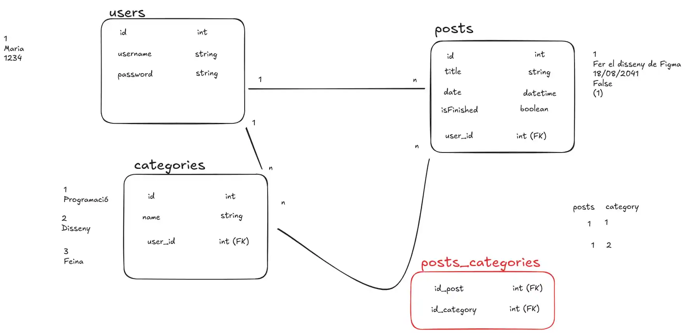

# Todo-django app

This is a simple todo app built with Django.

## Requirements

- Python 3.x
- Django 5.1.6
- Django Rest Framework 3.15.2
- Pillow 11.1.0
- Faker 36.11

## Commands List

| Command | Description | Custom
| --- | --- | --- |
| `python3 manage.py makemigrations` | Run database migrations. | False |
| `python3 manage.py migrate` | Run database migrations. | False |
| `python3 manage.py createsuperuser` | Create a superuser. | False |
| `python3 manage.py flush` | Clean the database. | False |
| `python3 manage.py shell` | Run a Python shell. | False |
| `python3 manage.py runserver` | Start the development server. | False |
| `python3 manage.py faker_models` | Run a faker | True |
| `python3 manage.py faker_models --flush` | Run a faker and clean the database | True |

## Installation

1.  Clone the repository:

    ```bash
    git clone https://github.com/emmaschzal/todo-django.git
    ```

2.  Navigate to the project directory:

    ```bash
    cd todo-django
    ```

3.  Create a virtual environment:

    ```bash
    python -m venv venv
    ```

4.  Activate the virtual environment:

    ```bash
    source venv/bin/activate
    ```

5.  Install the project dependencies:

    ```bash
    pip install -r requirements.txt
    ```
6.  Execute the migrations:

    ```bash
    python manage.py makemigrations
    ```
7.  Run the migrations:

    ```bash
    python manage.py migrate
    ```

8.  OPTIONAL: Create a faker examples:

    ```bash
    python manage.py faker_models
    ```

9.  Run the development server & open the application in your browser:

    ```bash
    python manage.py runserver
    ```

## Database model



## Authors
| Avatar | Name |
|---------------|:---------------------------------------------|
|  | Mar Falomi |
|  | Emma Sanchez |
|  | Albert Lanza |
